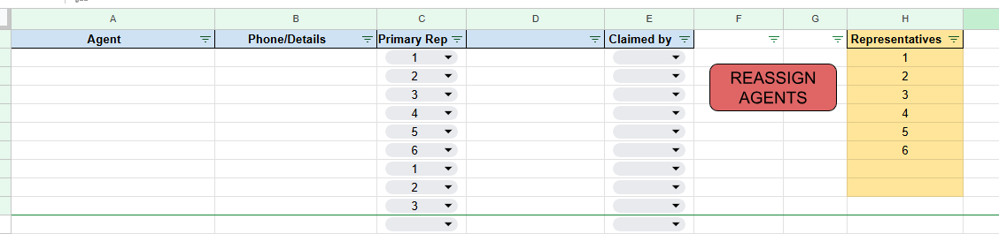
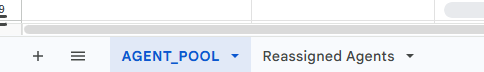

this script automates the reassignment of agents in a Google Sheet, archives claimed ones, redistributes the rest fairly, and locks sensitive columns for data integrity. It’s essentially a task redistribution tool for a sales/support team:

# Description (In Details)
- Admin-only access: Only the administrator (defined by ADMIN_EMAIL) can run the reassignment.
- Archive claimed agents: Moves any agents marked as “claimed” into a separate sheet called Reassigned Agents, along with a timestamp.
- Redistribute remaining agents: Randomly shuffles unclaimed agents and reassigns them to team members, while respecting quotas (so assignments are balanced).
- Rewrite the table: Clears the old assignments in the AGENT_POOL sheet and writes back the updated agent list.
- Lock agent data: Protects columns A–C (agent info) after the first run to prevent accidental edits.
- Confirmation: Shows alerts to the admin about progress (e.g., “No agents found” or “Reassignment completed”).

# How to Install:
1) In the Google Sheet go to 'Extensions'
2) then click on 'Apps Script' ( you should be taken to the new window)
3) replace your 'code.gs' file content with the given
4) replace preset email address with yours "const ADMIN_EMAIL = "youremail@gmail.com"" 
5) 'Save' 
6) go back to teh worksheet and use

# Google Sheet Set-up
youe Goog Sheet Setup should be somethign like :

1) In column 'H' insert the names of the staff members
2) Ask staff to insert name of teh Agents they want to share into 'A' column; details of teh agents they want too share into 'B' column; ask them to choose their names from the drop-down menue in the 'C' column
3) once all above has been done  - press 'Reassign Agents' button 
4) the column 'D' will be populated with names of reps that are responsible for corresponding agents ( choose in random order)
5) once the staff established contact with the agent , they will need to indicate this in teh 'E' column
6) next time You click press 'Reassign Agents' button, claimed agents withh be moved to another sheet ..

from 'Agent pool' to 'Reassigned agents' list; at the same time each new click on the button will rearrange the order of reassignment in the current list
Any questions ? Ask